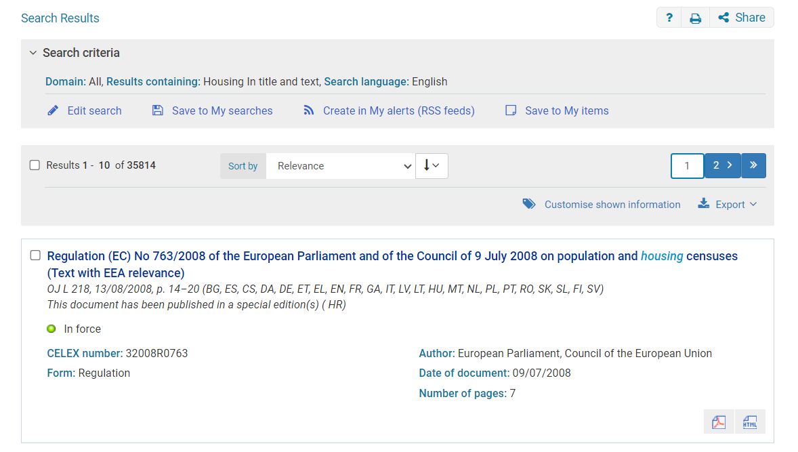
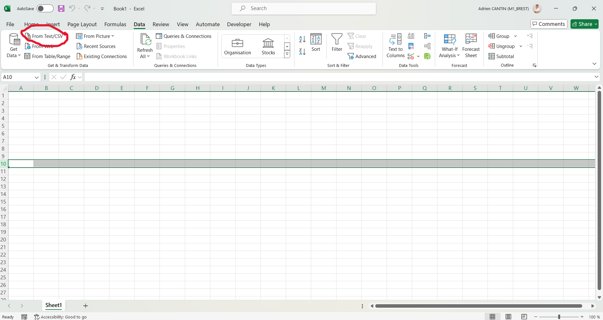

# AI_work

On this file, we focus on  the collection of the European data from EURLEX  https://eur-lex.europa.eu/homepage.html

## Exemple for one TSV file

The TSV file Search results 20240722.tsv is the result of a research on the advanced search system of the EURLEX websites available on this link https://eur-lex.europa.eu/advanced-search-form.html

The parameters are _Domain: All, Date of publication: 2023, Date of publication: 2023, Results containing: Housing In title and text, Search language: English_

When the searching is finish, you can export the legal act that has been found and choose the data that you want to keep in the export settings 
For the "Search results 20240722.tsv" , the parameters are :
_Title, Subtitle, CELEX number, Adopted acts,	Latest consolidated version,	ECLI identifier,	Transposed legal act(s),	Date of document_

Title and Subtitle couldn't be remove to the export.

After that you have a file in TSV format. In my experiment, I loaded it with excel and obtain the CSV file with the same name, find a screen with the tool, i used.

{:width="200px"}

